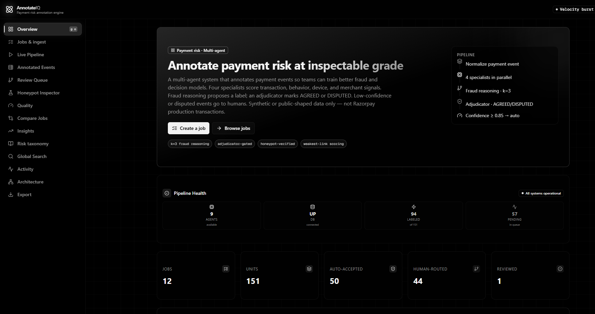
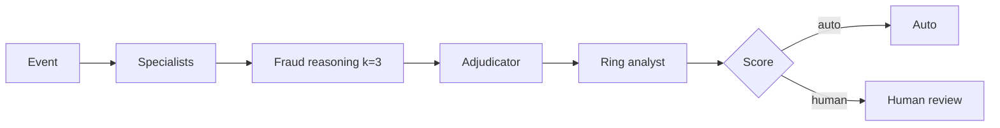
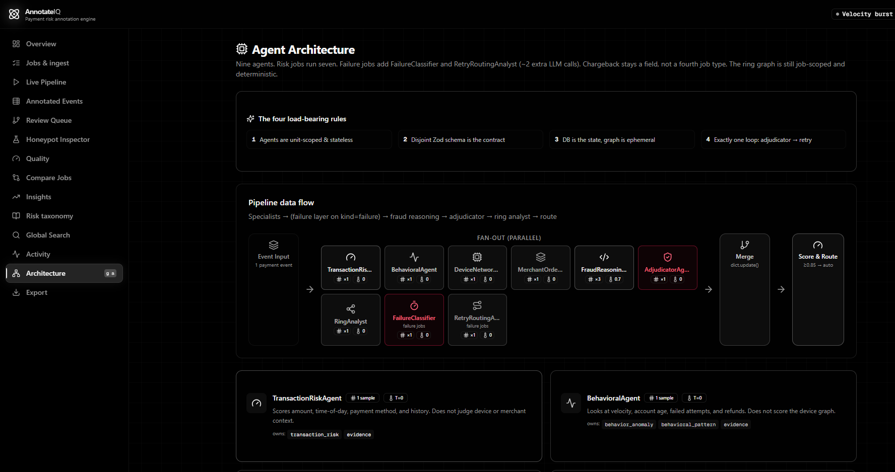

# AnnotateIQ

**Payment risk annotation engine** for the Razorpay AI Buildathon (AI Risk Manager track). A multi-agent pipeline that turns payment events into inspectable labels and actions so teams can train fraud and decision models. Every verdict carries evidence, confidence, and a route: auto or human review.

This repository is **AnnotateIQ**. It is not the earlier JEE Physics paper annotator. The GitHub clone URL may still say `Physics_Paper_Annotater` from that history — ignore that name; the product, README, and demo are payment-risk annotation only.

Live demo: [https://annotateiq.vercel.app](https://annotateiq.vercel.app)

<p align="center">
  
</p>

Synthetic and public-shaped data only. This is not a production risk engine and does not process Razorpay (or any other) live transactions.

## How it works

Each event is normalized, scored by specialists in parallel, then gated before it can leave the system.



**Risk jobs** run seven agents. **Failure jobs** add `FailureClassifier` and `RetryRoutingAnalyst`. Chargeback is a field, not a fourth job type. The entity graph is job-scoped and deterministic; agents do not invent edges.

<p align="center">
  
</p>

Routing uses weakest-link agreement on critical fields (`risk_label` / `recommended_action`, or `failure_reason` / `retryability`). Disputed or low-confidence units go to the review queue. Frozen honeypots and IEEE-CIS `isFraud` gold are mixed in as a **held-out** set (specialists never see gold). Quality reports:

- **Held-out precision and recall** on fraud = `HIGH`/`CRITICAL`
- **False-positive cost in INR** (blocked legitimate GMV + step-up friction + ₹40 ops per false alarm)
- Agreement (Fleiss' κ) and honeypot field accuracy as separate operational metrics — not substitutes for P/R

## Features

- Two job kinds: **risk** (label + action) and **failure** (reason + retry / routing)
- Nine specialists with disjoint Zod contracts — each agent owns a slice, not the whole verdict
- `k=3` self-consistency on fraud reasoning; adjudicator marks `AGREED` or `DISPUTED`
- Auto-route at confidence ≥ 0.85; everything else is human review
- Held-out P/R + FP cost, honeypot inspector, quality dashboard, job compare, and taxonomy coverage
- Ingest from dummy packs, pasted JSON/CSV, or an IEEE-CIS-shaped fixture
- Export JSONL, JSON, or CSV (auto-accepted plus human accept/edit only)
- Heuristic fallbacks when `SKIP_LLM=1` — labelled in the UI as **Deterministic fallback demo**

## Quick start

Requires **Node.js 20+**.

```bash
git clone https://github.com/PREETCHAUHAN2005/AnnotateIQ.git
# historical URL (same repo): Physics_Paper_Annotater.git
cd AnnotateIQ
cp .env.example .env
npm install
npx prisma db push
npm run dev
```

Open [http://localhost:3000](http://localhost:3000). Create a dummy pack, run the pipeline, open **Quality** for held-out precision / recall / FP cost, review what was routed to humans, then export.

## Configuration

| Variable | Default | Purpose |
|---|---|---|
| `DATABASE_URL` | `file:../db/custom.db` | Prisma SQLite URL. Required. |
| `SKIP_LLM` | unset | `1` skips LLM calls and uses deterministic heuristics. The app banners this as **Deterministic fallback demo**. |
| `DEMO_DISAGREE` | unset | `1` forces specialist disagreement so the human-review path is easy to demo. |

When `SKIP_LLM` is unset, specialists call `z-ai-web-dev-sdk`. Keep that config out of git.

`keepalive.sh` defaults to `SKIP_LLM=1` for the low-memory Cloud Agent loop. Do not present that recording as a live LLM run.

### Vercel

On Vercel the filesystem is read-only except `/tmp`. The app copies/bootstraps SQLite at `file:/tmp/annotate.db` and creates tables on cold start. That store is **ephemeral per isolate** — jobs can disappear after idle. Pipeline routes are capped at 300s. Production defaults `SKIP_LLM=1` unless you set `SKIP_LLM=0` and provide a working LLM client.

## Held-out metrics (Razorpay track)

Gold lives on honeypot / IEEE `isFraud` units and is never passed into specialists.

| Metric | Definition |
|---|---|
| Positive class | Fraud = predicted/gold `risk_label` ∈ {HIGH, CRITICAL} |
| Precision | TP / (TP + FP) on that held-out set |
| Recall | TP / (TP + FN) |
| FP cost (INR) | For each gold-negative predicted fraud: amount if HOLD/REJECT, 12% of amount if STEP_UP, plus ₹40 ops per alarm |

See Quality, Insights, and Compare. Agreement (κ) and honeypot accuracy remain on those screens as operational checks, not as P/R.

## Ingest

| Source | What you get |
|---|---|
| Dummy packs | Risk: `clean-retail`, `velocity-spike`, `geo-device-abuse`. Failure: `issuer-timeout`, `auth-fail`. |
| Paste / upload | JSON array, IEEE-shaped object, or CSV of payment events. |
| IEEE-CIS fixture | `data/ieee-cis-sample.json` (+ optional `data/ieee-cis-identity.json`). Cap: 400 events / 1.5 MB. The app never downloads Kaggle. |

Minimal event:

```json
{
  "transaction_id": "TX_10001",
  "merchant_id": "M_GROCERY_01",
  "customer_id": "C_4412",
  "timestamp": "2026-03-12T10:14:00Z",
  "amount": 842,
  "payment_method": "upi",
  "device_type": "android",
  "device_id_hash": "dev_clean_a",
  "ip_region": "IN-MH",
  "billing_region": "IN-MH",
  "shipping_region": "IN-MH",
  "previous_transaction_count": 48,
  "failed_attempts_1h": 0,
  "refund_count_30d": 0,
  "chargeback_history": 0,
  "account_age": 640,
  "order_value": 842,
  "product_category": "grocery",
  "payment_status": "captured"
}
```

Failure events add `decline_code` and `gateway_message`.

## Labels

| Field | Values |
|---|---|
| Risk | `LOW` `MEDIUM` `HIGH` `CRITICAL` |
| Action | `ALLOW` `REVIEW` `STEP_UP_VERIFICATION` `HOLD` `REJECT` |
| Failure reason | `insufficient_funds` `issuer_decline` `technical_failure` `authentication_failure` `network_failure` `timeout` `bank_downtime` `configuration` `unknown` |
| Retryability | `do_not_retry` `retry_same_rail` `retry_alternate_route` `retry_later` `retry_with_step_up` `contact_issuer` `unknown` |

Taxonomy lives in `src/lib/data/taxonomy.json`.

## Export

`GET /api/jobs/:id/export?format=jsonl|json|csv`

Rows include the merged annotation, confidence, agreement, route, cluster fields, and (for failure jobs) retry / routing. Rejected reviews are excluded.

## Stack

Next.js 16 · React 19 · TypeScript · Prisma / SQLite · Zod · Tailwind CSS 4
